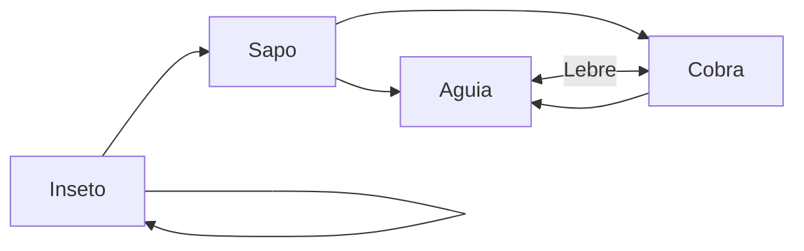

- uma estrutura matemática na qual a teoria dos [[conjunto fuzzy]] é definido
- é um [[Conjunto parcialmente ordenado]] se qualquer subconjunto finito possui [[Supremo]] e ínfimo

**Reticulado completo** é quando $\mathbb{L},\leq$ se todo subconjunto $X\subset \mathbb{L}$, finito ou infinito, admite ínfimo e supremo em $\mathbb{L}$ 
***Exemplo***: $\mathbb{R}^2$ é um reticulado, mas não é um reticulado completo.

[[Relação binária]]
- Se um par ordenado $(u,v)$ pertence a relação $\mathscr{R}\subset u\times V$, diremos que u está relacionado com v pela relação $\mathscr{R}$ e, muitas vezes, denotamos por $u\mathscr{R} V$ 
- **Exemplo**, a relação presa-predador do exemplo anterior pode ser representada pelo seguinte [[Grafo]]

### Operação Meet e Join
Um reticulado $(\mathbb{L},\leq)$ também pode ser visto como um [[Conjunto]] $\mathbb{L}$ munido com duas operações binárias $\wedge$ $\vee$, chamadas [[meet]] e [[join]]
$$X \land y=\inf \{x,y\}~~e~~x\vee y=\sup\{ x,y \}$$   
- Adimite [[Associatividade]]
- Admite [[Comutatividade]]
- Admite [[Idepotência]]
- Admite [[Absorção]] $(x\vee y)\wedge x =x$ 

[[Teorema de Birkhoff]]
Um [[Conjunto]] munido de operações binárias $\wedge$ e $vee$ que satisfazem as propriedades de associatividade, comutatividade, idempotência e absorção é um reticulado com a relação de ordem definida por $$x\leq y\Rightarrow x\wedge y=x~~(ou ~x\vee y=y)$$
