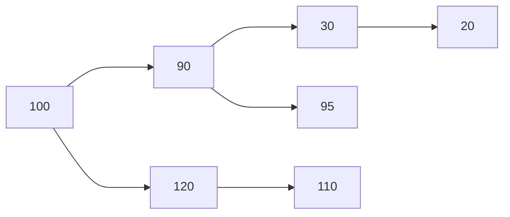
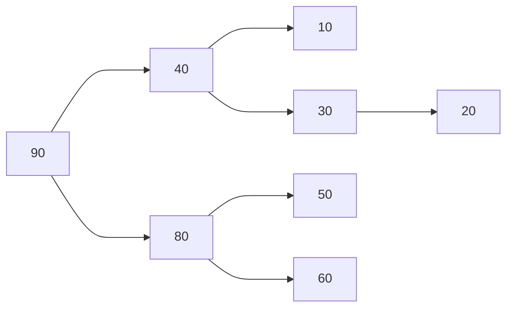

- Uma vez ordenada a sequência de números, a busca por qualquer número na sequência pode ser realizada em $O(Log(n))$ 

```c
bool BuscaBinaria(int *A, int p, int q, int ch, int *pos){
	if (p<q){
	int r= (p+q)/2;
	if (A[r]==ch){
		*pos = r;
		return(true);}
		else{
			if (A[r] < ch)
				return(BuscaBinaria(R, r+1, q, ch, pos));
			else
				return(BuscaBinaria(A, p, r-1, ch, pos));}
				}
	return(false)
}
```

### Busca em árvore binária
Uma árvore [[Árvore binária]] é dita ser de busca se qualquer nó x dela
- todos os nós da **Subárvore esquerda** de x têm valores **menores** do que o valor e
- Todos os nós da **Subárvore direita** x têm valores maiores do que o valor de x


```c
void Insere(ABB**T, int valor){
	if (*T ==NULL){
		*T = criaNo(valor);}else{
		if ( (*T)->info < valor){
			Insere(&(*T)->dir), valor;}else{
			Insere(&(*T)->esq), valor;}
	}
}
```



podemos representar
100, 90, 80, 30, 40, 60, 50, 20
* Filho esquerdo $2i+1$
* Filho direito $2i+2$

```c
typedef struct _head{
	int *info;
	int tam_max, nelems;
} heap;

void DesceHeap(heap *h, int i){
	int e=FilhoEsq(i);
	int d=Filhodir(i);
	int maior=i;
	if (e<n && h[e]>h[i]){
		maior=e;}
	if (d<n && h[d]>maior){
		maior=d;}
	if (maior !=i){
		h[i] = h[maior];
		DesceHeap(H, maior);}
}

void RemoveHeap(heap *h){
	int info;
	if (!HeapVazio(h)){
		h[0] ==h[n-1];
		h->nelems--;
		DesceHeap(h, o);}
	return 
}

void SobeHeap(heap*h){
 //Se um elemento muda a prioridade, ele precisa subir na árovre
 int pai = Pai(i);
 while (pai >=0 e h[i]>h[pai]){
	 h[pai] <-> h[i];
	 i=pai;
	 pai=Pai(i);}
}
```
