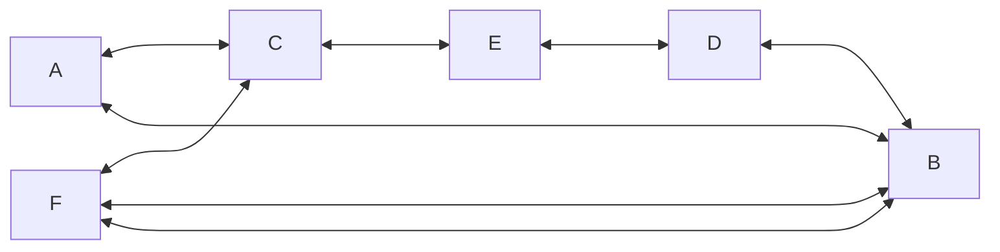
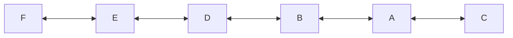
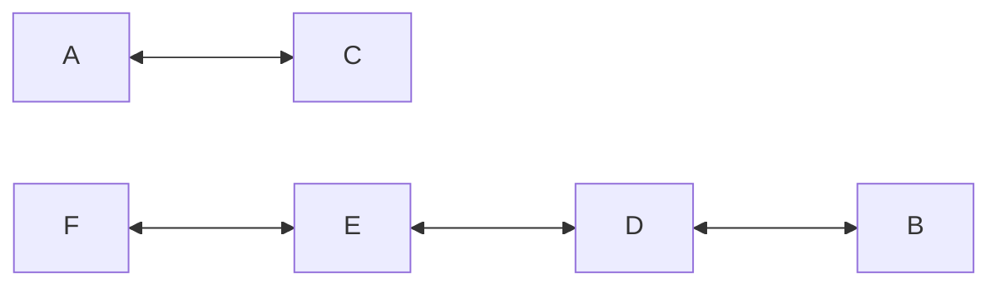

#### Subgrafo
- Um grafo $G'= (N', A')$ é um subgrafo de um grafo $G=(N, A)$
- Uma árvore $G'$ de G é um subgrafo acíclico

**Grafo G**

```mermaid
graph LR
A<--->C<--->E<--->D<--->B<--->A
F<--->C
F<--->B
F<--->B
```
**Árvore Geradora**

```mermaid
graph LR
F<--->E<--->D<--->B<--->A<--->C
```

```mermaid
graph LR
A<--->C
F<--->E<--->D<--->B
```
