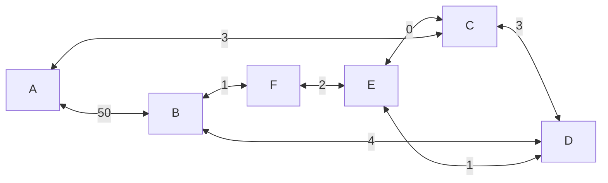

### Busca em Largura

**Algoritmo**

**Para** $u \in \mathscr{N}$
	$C(u)\leftarrow +\infty$
	$Cor(u)\leftarrow branco$
	$P(u)\leftarrow nil$
	**Se** $u=u_1$
		$C(u)\leftarrow 0$
		***Insere*** u em Q
		$Cor(u)\leftarrow Cinza$
**Enquanto** $Q \neq \emptyset$ 
	***Remove*** u de Q
	$Cor(u)\leftarrow Preto$
	**Para** $v \in \mathscr{A}(u)$ e $Cor(u)=branco$
		$P(v)\leftarrow u$ 
		$C(v)\leftarrow C(u)+1$
		***Insere*** v em Q
		$Cor(v)\leftarrow Cinza$ 
		

### Busca profunda

**Algoritmo**

**Para** $\large u \in \mathscr{N}$ 
	$C(u)\leftarrow +\infty$
	$cor(u)\leftarrow branco$
	$P(u)\leftarrow ~nil$ 
	**Se** $u = u_1$
		$C(u)\leftarrow 0$
		**Empilha** $u$ em Q
		$Cor(u)\leftarrow Cinza$
**Enquanto** $Q\neq \emptyset$
	***Desempilha*** $u$ de Q
	$Cor(u) \leftarrow Preto$
	**Para** v em $\mathscr{A}(u)$ e $cor(v) \neq Preto$ 
		$P(v)\leftarrow u$
		$C(v)\leftarrow C(u)+1$
		**Se** $Cor(u)=branco$
			***Empilha*** v em Q
			$Cor(v)\leftarrow Cinza$ 


### Função de custo de caminho
- Seja c uma [[função]] que atribui valor de custo para qualquer caminho no grafo
- Se $\pi$ é um caminho que sai de um nó x 
**Exemplo**
	$C(<v>)=\begin{cases}0,~~se~~v=u_1\\+\infty,~~\text{Caso contrário}\end{cases}$




**Algoritmo**

**Para** nó $S \in \mathscr{N}$
	$C(s)\leftarrow +\infty$ 
	$P(s)\leftarrow nill$
	**Se** $S \in \mathscr{S}$ 
		$C(s)\leftarrow 0$ e insere em Q
**Enquanto** $Q \neq \emptyset$ 
	***Remove*** S de Q tal que $S=argmin_{t\in Q} \{C(t)\}$ 
	**Para** $t \in \mathscr{A}(S)$ tal que $Cor(t) \neq Preto$
		$tmp\leftarrow C(s)+W(s,t)$
		**Se** $tmp < C(t)$
			**Se** $Cor(t)=Cinza$
				***Remove*** t de Q
			$C(t)\leftarrow tmp$
			$P(t)\leftarrow s$
			***Insere*** t em Q
			$Cor(t)\leftarrow Cinza$

```c
typedef struct no_grafo{
	char nome;
	int custo, pred;
	Lista *A;
}NoGrafo;

typedef struct _grafo{
	NoGrafo *G;
	int n;
}Grafo;

typedef struct _lista{
	int adj;
	int peso;
	struct _lista *prox;
}Lista, NoLista;

Lista *L;
Grafo *G;

G->no[0], nome='A';

```