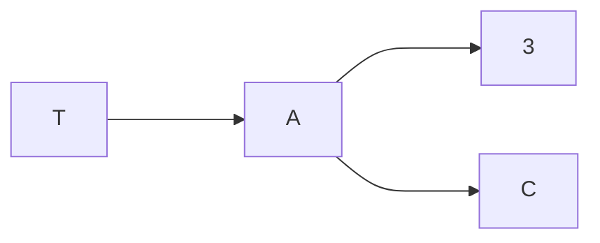
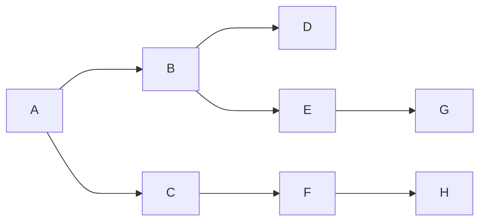

Uma árvore binária é um conjunto finito de T objetos, denominados nós ou vértices, tal que:
- ou T é vazio
- T Consiste de um nó distinto, denominado raiz de T, e de duas árvores esquerda e direita de T(ou da raiz de T), respectivamente. Essa definição é recursiva para qualquer nó.


### Percurso em largura
Os nós da árvore são visitados em largura quando o percurso segue a ordem crescente de nível dos nós
- A partir de um nó, retorna todos os nós filhos em ordem crescente

```c
void ImprimeLargura(arvin *T){
	Fila *Q = CriaFila(Numeros(T));
	if (T != NULL){
		InsereFila(Q, T);
		while (!FilhaVeja(Q)){
			NoArvbin *no = RemoveFila(Q);
			printf("%d \n", no->info)
		}
	}
}
```

ideia:

A fila começa vazia, adicionamos A
Fila = [A];
Mostra o elemento da fila e adiciona os nós de A na fila
A ; Fila = [B, C];

Seguimos com o mesmo procedimento.

Mostra o elemento da fila que é B e adiciona os nós de B,
B ; Fila = [C, D, E];

Mostra o elemento da fila que é C e adiciona os nós de C,
C; Fila = [D, E, F];

Mostra o elemento da fila que é C e adiciona os nós de D,
D; Fila = [E, F];

Mostra o elemento da fila que é E e adiciona os nós de E,
E; Fila = [F, G];

Mostra o elemento da fila que é F e adiciona os nós de F,
F; Fila = [G, H];

Mostra o elemento da fila que é G e adiciona os nós de G
G; Fila = [H];

Mostra o elemento da fila que é H e adiciona os nós de H
H; Fila = [];

Fim