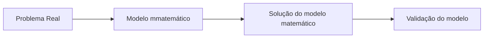

***Terças e Quintas***

**Problema**
Temos a função f que chamamos de função objetivo, definida no conjunto de soluções alternativas, digamos $\Omega$ 
assim, um problema de otimização é definido por
$$\min f(x); x \in \Omega$$
x é a variável de desição; $x = (x_1,x_2,x_3,...)$
$\Omega$: Conjunto factível, contém todas as alternativas viáveis
f(x) é a função objetivo que determina o critério de escolha
**Exemplo**
$\max f(x_1,x_2)=2x_1+x_2$
sujeito a $\begin{cases}x_1+x_2\leq \\ x_1\geq 0, x_2 \geq 0\end{cases}$

