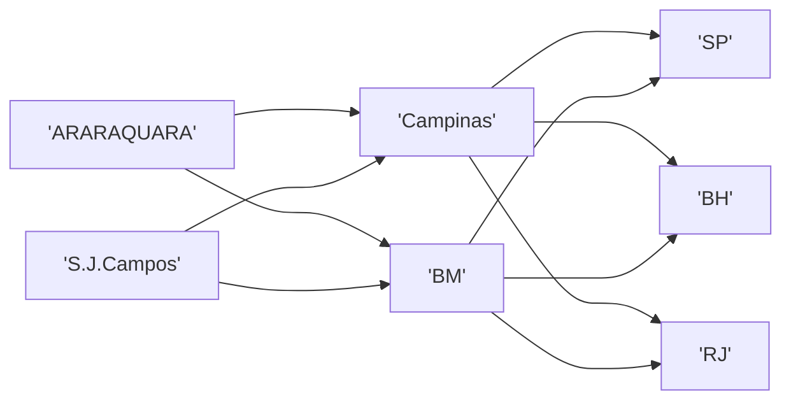

### Problema da mistura
Está em achar a melhor combinação de materiais para a produção final.
**Exemplo**

|     | |Carnes | vegetais | Composição |
| --- | - |------ | -------- | ---------- |
|     |  - |      |          |            |

### Mix de produção
**Planejamento de produção**
- Recursos limitados/capacidade($C_j$)
- Produção de cada produto i consome uma quantidade de cada tipo de recurso ($a_{ij}$)
- A cada produto está associado um lucro ($l_i$)
- Há uma demanda mínima ($u_i$) e máxima ($v_i$)
$$\max\sum_{i=1}^m l_ix_i$$
$\displaystyle \text{Sujeito a}: \displaystyle \begin{cases}\displaystyle\sum_{i=1}^{m} a_{ij}x_i\leq C_j, j=1,...,n\\ u_i\leq x_i \leq v_i , i=1,2,3...,m\end{cases}$

**Exemplo**
Uma industria de móveis dispõe de dois tipos de peças de madeira, A,B, usadas para construir cadeiras e mesas.

- Cada cadeira fornece um lucro de R$60,00 e usa 2 peças do tipo A e 1 Peça do tipo B
- Cada mesa fornece um lucro de R$90,00 e usa 2 peças do tipo A e 2 peças do tipo B
- A indústria tem disponível, para produção de mesas e cadeiras, 14 peças do tipo A e 8 peças do tipo B.

Escreva um modelo matemática que visa maximizar o lucro dessa empresa.

$c$ é a quantidade de cadeiras
$m$ é a quantidade de mesas
$\max f(x)=60c+90m$ 
$s.a:\begin{cases}2c+2m\leq 14\\ 1c+2m\leq 8\\ c\geq 0;m\geq 0\end{cases}$

### Problema do transporte

**Exemplo**
Vamos distribuir bebidas de 2 centros para 3 cidades, representamos o custo de transportar de um centro para uma cidade, a demanda de cada mercado e o suprimento disponível em uma tabela

| Centro de suprimento | São Paulo | Belo Horizonte | Rio de Janeiro | $\text{Suprimento disponível}$ |
| -------------------- | --------- | -------------- | -------------- | --------------------- |
| Araraquara           | 27,7      | 59,8           | 70,8           | 800                   |
| S.J. Campos          | 10,4      | 52             | 34,1           | 1000                  |
| $\text{Demanda dos mercados}$ | 500       | 400            | 900            |                       |

Definimos $x_{ij}$ como a quantidade do produto a ser enviada do centro de produção ao mercado
Assim:
$\begin{cases}x_{11}+&x_{12}+&x_{13}&&&\leq 800\\ &&&x_{21}+&x_{22}+&x_{23} \leq 1000 \\ x_{11}+&&&x_{21}&&=500\\ &x_{12}+&&&x_{22}&=400\\ &&x_{13}+&&&x_{23}=900\end{cases}$
e $x_{11}\geq 0, x_{12}\geq 0, x_{13}\geq 0,x_{21}\geq 0, x_{22}\geq 0,x_{23}\geq 0$

### Problema de transbordo

Em certos casos construímos intermediários

### Problema da dieta
Sabendo-se que cada alimento tem um certo custo e uma determinada quantidade de nutrientes. Qual a dieta (de menor custo) que atende as restrições nutricionais?

| Nutriente | 1   | 2   | 3    | Qtd Mínima |
| --------- | --- | --- | --- | ---------- |
| A         | 2   | 3   | 7   | 10         |
| B         | 4   | 2   | 1   | 15         |
| C         | 1   | 8   | 1   | 10         |
| D         | 30  | 1   | 1   | 2          |
| Custo/Kg  | 20  | 10  | 10  |            |
|           |     |     |     |            |
$x_1$ Quantidade do alimento 1
$x_2$ Quantidade do alimento 2
$x_3$ Quantidade do alimento 3
temos que $2x_1+3x_2+7x_3\geq 10$ para o nutriente A
temos que $4x_1+2x_2+x_3\geq 15$ para o nutriente B
temos que $x_1+8x_2+1x_3\geq 10$ para o nutriente C
temos que $30x_1+x_2+x_3\geq 2$ para o nutriente D

Para o custo
temos que minimizar a $f(x)=20x_1+10x_2+10x_3$
com $x_i\geq 0;i=1:3$ 

### Problema de planejamento da produção
- Recursos limitados
- a produção de cada produto j consome uma quantidade de cada recurso i
- cada produto representa um lucro $l_j$
- há demanda mínima $d_j$ e máxima $v_j$
$$\max \sum_{j=1}^n l_jx_j$$
Sujeito a: $\displaystyle \begin{cases}\displaystyle\sum_{j=1}^n a_{ij}x_j \leq c_i, i=1,2,...,m\\ d_j\leq x_j \leq v_j, j=1,2,...,n\end{cases}$
Uma empresa fabrica diversos produtos e tem uma carteira de pedidos para o mês atual. Existe mais de uma maneira 
*Sejam*
- $c_{ij}$ o custo de fabricar uma unidade do produto i no processo j
- $d_i$ é a demanda do produto i
- $b_k$ é a quantidade disponível do produto k
- $a_{ijk}$ quantidade do recurso k para produzir o produto i através do processo j
- $j_i$ conjunto dos processos que podem ser utilizados para fabricar o produto i
*Variáveis de decisão*
$x_{ij}$ quantidade do produto i fabricado pelo processo j
$\min\displaystyle \sum_{i=1}^n \sum{j\in J_i} c_{ij}x_{ij}$
$\text{sujeito a:}\begin{cases}\displaystyle \sum_{j\in J_i}x_{ij}=d_i,\hspace{2cm}i=1,2,...,n\\ \displaystyle\sum_{i=1}^n \sum_{j\in J_i}a_{ijk}x_{ij}\leq b_k,\hspace{2cm} k=1,2,...,K\\ x_{ij}\geq 0,\hspace{2cm} i=1,2,...,n;j\in J_i\end{cases}$
#### Dimensionamento de lote
Empresas de manufatura, em geral, fabricam diversos tipos de produtos solicitados por diferentes clientes, muitas vezes em grandes quantidades datas previamente discutidas.
- necessidade de antecipar alguns produtos, gerando estoque
- Atender a demanda na data solicitada, minimizando o custo de produção e de estocagem 
- a demanda a cada período é conhecido
- podemos estocar
- conhecemos a demanda por recurso
- os recursos são renováveis(Por período)
*Parâmetros*
- $s_{it}$ é a demanda do item i no período t
- $R_t$ disponibilidade de recursos no período t
- $r_i$ quantidade de recursos necessários para a produção de uma unidade do item i
- $c_{it}$ custo de produzir uma unidade do item i no período t
- $h_{it}$ custo de estocar uma unidade do item i no período t
- 
*Variáveis de decisão*
- $x_{it}$ número de itens do tipo i produzidos no período t
- $I_{it}$ número de itens em estoque no fim do período t
*Restrições*
$I_{it}=I_{i,t-1}+x_{it}-d_{it},~~~~i=1,...,n;~~~~t=1,...,T$ (Conservação de estoque)
$r_1x_{1t}+r_2x_{2t}+...+r_nx_{nt}\leq R_t,\hspace{2cm}t=1,2,...,T$(Utilização de recursos)
$I_{it}\geq 0,\hspace{2cm} i=1,2,...,n;\hspace{2cm}t=1,2,...,T$
*Função objetivo*
$$f(x_{11},I_{11},x_{12},I_{12}...,)=\sum_{i=1}^n\sum_{t=1}^T c_{it}x_{it}+\sum_{i=1}^n\sum_{t=1}^T h_{it}I_{it}$$
Sujeito a:
$x_{it}+I_{i,t-1}-I_{it}=d_{it}, \hspace{2cm}i=1,2,...,n \hspace{2cm}t=1,2,...,T$
$r_1x_{1t}+r_2x_{2t}+...+r_nx_{nt}\leq R_t, \hspace{2cm} t=1,2,...,T$
$x_{it}, I_{it}\geq 0,\hspace{2cm} i=1,2,...,n;\hspace{2cm} t=1,2,...,T$

