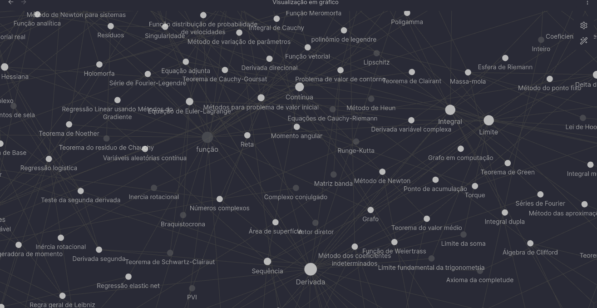

### Obsidian
Obsidian é um aplicativo de anotações que permite construir gráficos, excrever em Latex e tem uma ampla gama de opções. Nele eu fui construindo todo meu conhecimento na matérias em matemática aplicada. Então aqui você podera abrir minha anotações da maneira que seja razoável.

## Imagens da árvore de conhecimento

##### Estrutura
O conhecimento está organizado em pastas relativas a matérias. Em cada pasta existe uma subpasta que armazena as imagens da seção.

- Em cada pasta existe uma subpasta chamada "Imagens" que contém todas as imagens usadas nos artigos locais

- Cada artigo visa ter um tema expecífico e internamente referenciar outros artigos relevantes sempre em verde claro

- As Fórmulas são construídas usando a linguagem de escrita "Latex"

- Gráficos mais avançados são construídos com o Plugin 

- As tabelas são construídas com o Plugin 

- Códigos são inseridos nativamente na linguagem Markdown

##### Atualizações

Conforme vou progredindo na graduação e possivelmente na pós-graduação, irei inserindo cada novo conhecimento como um artigo e conectar com os existentes.

Você é livre para ajudar escrevendo uma artigo.

